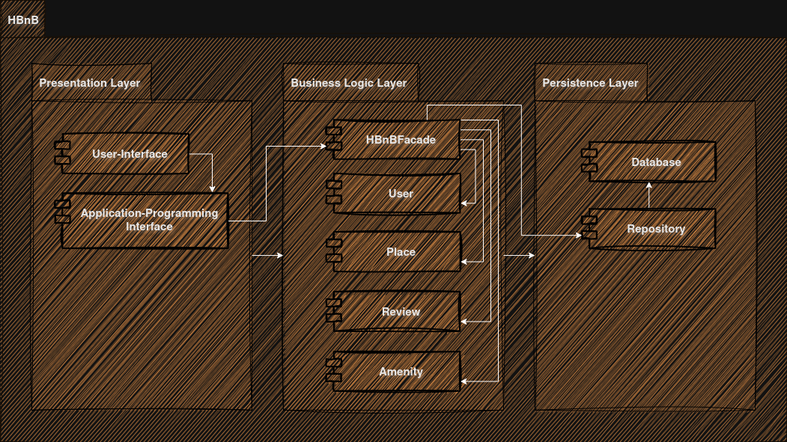
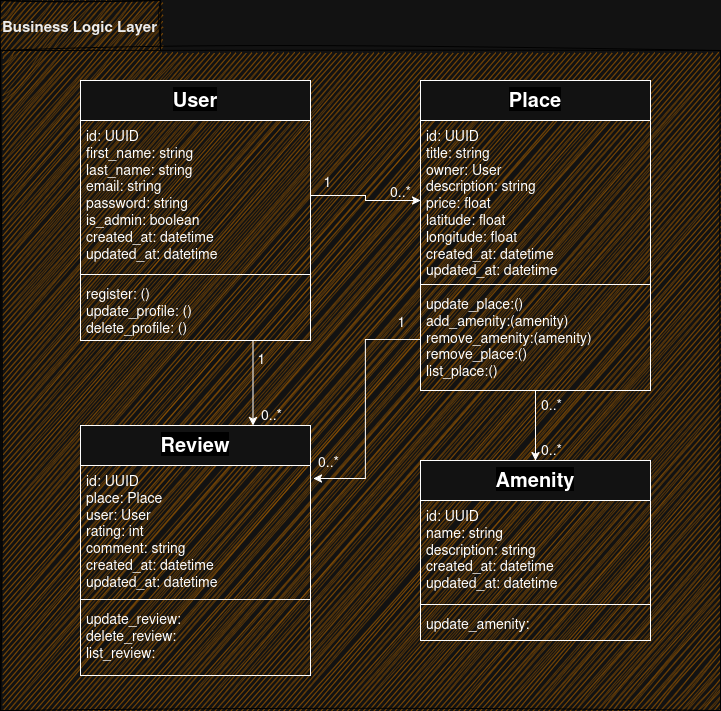
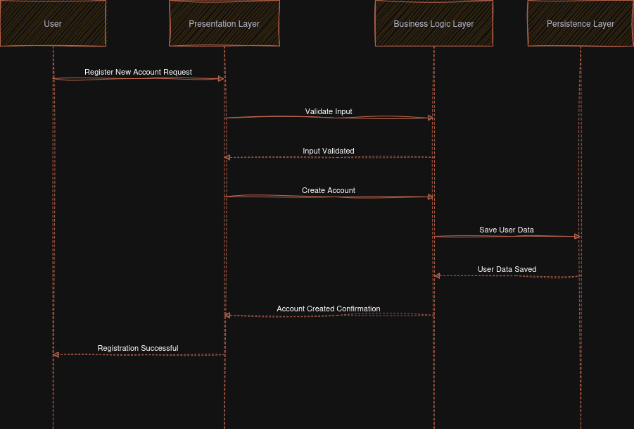
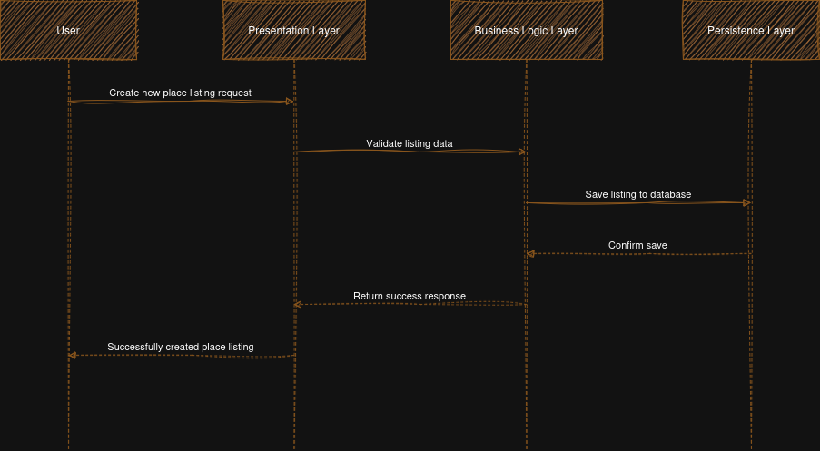
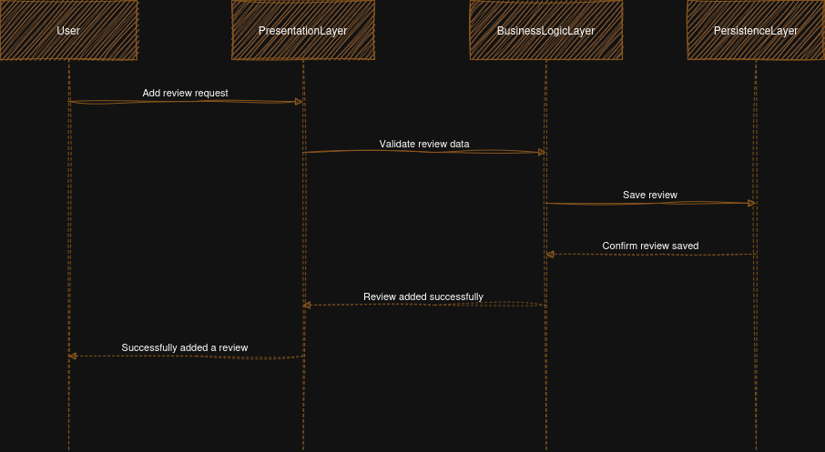
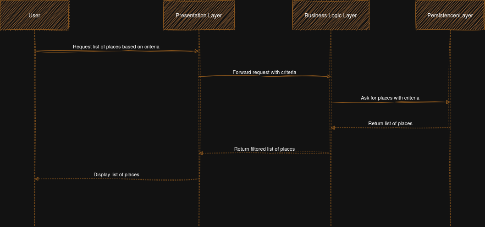

# HBnB Architecture and Design Documentation

## 1. Introduction

HBnB is a layered web application designed to manage users, places, reviews, and amenities through a structured and scalable architecture.

This document provides a technical overview of the system’s architecture and design to guide development and implementation. It presents the high-level architecture, the business logic layer design, and the interaction flow of key API operations.

## 2. High-Level Package Diagram

### Purpose

This high-level package diagram illustrates the three-layer architecture of the HBnB application and the communication between these layers via the facade pattern. This diagram will provide a conceptual overview of how the different components of the application are organized and how they interact with each other.

### Diagram Overview

The HBnB application follows a three-layer architecture composed of a Presentation layer, a Business Logic layer, and a Persistence layer. The Presentation layer is responsible for handling external interactions such as API requests and user-facing services. The Business Logic layer contains the core domain logic and rules that govern the application’s behavior, while the Persistence layer manages data storage and retrieval.

Dependencies flow strictly from the Presentation layer to the Business Logic layer and from the Business Logic layer to the Persistence layer, ensuring separation of concerns and maintainability.Dependencies flow strictly from the Presentation layer to the Business Logic layer and from the Business Logic layer to the Persistence layer, ensuring separation of concerns and maintainability.

### Facade

The Facade pattern is used to provide a simplified and unified interface between the Presentation layer and the Business Logic layer. Instead of allowing the Presentation layer to interact directly with multiple domain components, all requests are routed through the facade, which coordinates the required business operations.

This approach reduces coupling between layers, enforces architectural boundaries, and centralizes application workflows within the Business Logic layer.

## 3. Detailed Class Diagram for Business Logic Layer

### Purpose

This detailed class diagram will depict the entities within the Business Logic layer, their attributes, methods, and the relationships between them. The primary goal is to provide a clear and detailed visual representation of the core business logic, focusing on its key entities.

### Core Entities

The core entities represent the primary business concepts of the HBnB application:

- **User**: Represents a registered user of the system who can create places and write reviews.
- **Place**: Represents a property listed by a user, including descriptive and location-related information.
- **Review**: Represents feedback provided by a user for a specific place.
- **Amenity**: Represents a feature or service that can be associated with one or more places.

## 4. Sequence Diagrams for API Calls

### Purpose

These sequence diagrams illustrate the interaction between the layers (Presentation, Business Logic, Persistence) and the flow of information within the HBnB application for at least four different API calls. The sequence diagrams will help visualize how different components of the system interact to fulfill specific use cases, showing the step-by-step process of handling API requests.

### Sequence Diagrams Overview

1. User Registration – Shows the process from receiving the registration request at the Presentation layer, validating and creating the user in the Business Logic layer, and persisting the data.

2. Place Creation – Illustrates how a new property listing is handled, including validation, association with a user, and storage.

3. Add Review – Demonstrates the flow for submitting a review, linking it to the user and place, and saving it in the database.

4. Fetch Filtered List of Places – Depicts how filtering parameters are processed to retrieve a specific subset of places from the Persistence layer back to the Presentation layer.
